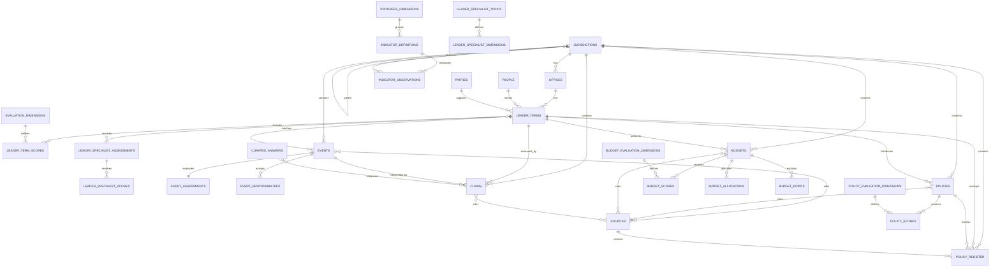

# India Mechanics Architecture

Last updated: 2026-08-05

This document is the operating map for the India Mechanics research system. It
describes where data comes from, how evidence becomes a published record, how
scores are computed, how agents should refresh the project, and how the same
model extends from India and Prime Ministers to states and Chief Ministers.

## 1. Product contract

India Mechanics must let a human or agent answer questions such as:

- Has India progressed since independence?
- As of now, is there an evidence-based case for constitutional electoral
  change or continuity?
- What did each government achieve, mishandle, or damage?
- What did each Union Budget prioritise, allocate, borrow, and leave unfunded?
- Which protests, riots, wars, disasters, reforms, and institutional changes
  altered the country’s direction?
- What is measured fact, what is interpretation, and what is editorial judgment?
- How current is the evidence?

The product is not a neutral oracle. No historical synthesis or scoring system
can be free of judgment. The project instead makes judgment inspectable:

1. observations, events, claims, and ratings are different record types;
2. every claim and event has provenance;
3. source fitness and limitations are explicit;
4. time and knowledge cutoffs are visible;
5. missing data remains missing;
6. scores disclose their components and weights;
7. contested evidence can be represented as contested;
8. agents can retrieve the same evidence as the UI through JSON.

## 2. Runtime architecture

```text
React + Vite multi-jurisdiction frontend
        |
        | /api via Vite proxy
        v
Express read API
        |
        v
SQLite generated database
        ^
        |
checked-in national/state seed catalogs + generated indicator snapshot
        ^
        |
World Bank API / V-Dem mirror / reviewed manual research
```

### Technology choices

- **React 19 + Vite 8**: responsive human interface.
- **Recharts**: time-series and comparison graphs.
- **Express 5**: small read-only HTTP API.
- **Node `node:sqlite`**: no external database service for the first release.
- **TypeScript**: shared compile-time contracts.
- **Vitest + Supertest**: formula, database-integrity, and API tests.

SQLite is appropriate while the corpus is maintained by a small number of
researchers and agents. Move to PostgreSQL when concurrent writes, user accounts,
review queues, or a large state-level corpus require a service database. The
relational model is intentionally portable.

### LLM and crawler delivery contract

The canonical public origin is
`https://india-mechanics.artfiesco.chatgpt.site`. Machine and crawler surfaces
must publish absolute URLs rooted at that origin rather than assuming that a
consumer can resolve repository-relative or site-relative paths.

The compact leader endpoint is:

```text
https://india-mechanics.artfiesco.chatgpt.site/api/llm/leaders/<term-id>
```

It is the bounded retrieval representation for one office term. Its contract
includes term and jurisdiction identity, dates, the unified six-category
scorecard, overall and confidence, category rationales, nested specialist deep
dives, bounded source records, omission counts, assessment date, and relevant
cutoff metadata.

The human HTML fallback is:

```text
https://india-mechanics.artfiesco.chatgpt.site/?jurisdiction=<jurisdiction-id>&view=leaders&term=<term-id>
```

The initial response for that deep link must contain leader-specific crawlable
metadata or content. Serving only the generic Vite root and requiring JavaScript
to discover the selected leader is insufficient for search crawlers, link
unfurlers, and retrieval systems that do not execute the client bundle.

Production builds must generate `robots.txt` and `sitemap.xml` from the
canonical origin and the same published jurisdiction/leader snapshot used by
the hosted API. `robots.txt` allows the public research surface and APIs and
advertises the absolute sitemap URL. `sitemap.xml` contains absolute canonical
human deep links for every published jurisdiction and leader term. Generated
discovery files must not enumerate unpublished, invalid, or stale term IDs.

These are implementation and publication requirements, not evidence that a
particular deployment is already current. A release is crawler-ready only after
the compact endpoint, human HTML fallback, `robots.txt`, and `sitemap.xml` are
verified at the canonical origin.

## 3. Repository map

```text
AGENTS.md                              agent research and verification contract
architecture.md                        this document
data/india-mechanics.sqlite            generated runtime DB, gitignored
public/llms.txt                         agent discovery and interpretation rules
robots.txt and sitemap.xml              generated production discovery outputs
scripts/fetch-indicators.ts             machine-data refresh
scripts/fetch-bill-register.ts           official government-bill register refresh
scripts/extract-bill-documents.ts         official-PDF purpose extraction and cache
scripts/check-sources.ts                live source-link validation
server/schema.ts                        SQLite DDL
server/seed.ts                          deterministic DB build
server/progress.ts                      Country Progress calculations
server/scoring.ts                       normalization and aggregation math
server/leader-scorecards.ts             current equal-category PM/CM scorecard
server/rating-profiles.ts               legacy weighted sensitivity lenses
server/specialist-ratings.ts            specialist-topic weighted scoring
server/app.ts                           read API
server/seed-data/catalog.ts             reviewed sources, terms, events, claims
server/seed-data/budgets.ts             reviewed budgets, allocations, and ratings
server/seed-data/security.ts            all-PM national-security assessment lane
server/seed-data/crime-safety.ts        crime, justice, cyber, and current-news lane
server/seed-data/semiconductors.ts       cross-term semiconductor history and policy lane
server/seed-data/infrastructure-capacity.ts modern infrastructure and productive-capacity specialist lane
server/seed-data/andhra-pradesh.ts      post-split AP state and CM corpus
server/seed-data/tamil-nadu.ts          modern Tamil Nadu state and CM corpus
server/seed-data/research-metadata.ts   knowledge and review cutoffs
server/seed-data/generated-indicators.json checked-in feed snapshot
server/seed-data/generated-bills.json    checked-in Sansad government-bill snapshot
server/seed-data/generated-bill-documents.json checked-in official-text extracts
src/                                   React interface
src/views/SafetyView.tsx               crime, justice, and current-signal UI
tests/                                 scoring, provenance, API, state fixture
.openai/hosting.json                   persistent Sites project identity
hosting/worker.ts                       hosted static/API snapshot worker
```

The SQLite file is disposable. The reproducible source of truth is the schema,
catalog, research metadata, and generated indicator snapshot.

## 4. Truth model

### Observation

A numeric value for one indicator, jurisdiction, period, status, and source.

Examples:

- life expectancy in India in 2024;
- V-Dem electoral democracy estimate in 2025;
- multidimensional poverty estimate for 2022–23.

An observation may be `observed`, `estimated`, or `modelled`. Those labels affect
confidence and must never be removed for presentation.

Administrative programme coverage, household-survey access or use, village
declarations, and modelled population estimates are separate measurement
families. They may corroborate direction, but they must not be joined into one
before-and-after series unless the denominator and definition are genuinely
comparable. WHO/UNICEF JMP sanitation estimates retrieved through the World Bank
API are stored as `modelled`, not `observed`.

Indicators can be `scored` or `context`. Contextual series such as a nominal
exchange rate remain searchable and comparable by PM data window, but they do
not receive a higher-is-better or lower-is-better judgment and do not enter the
Country Progress Index.

### Event

A dated historical occurrence with:

- jurisdiction;
- start and optional end date;
- category;
- summary;
- significance;
- confidence;
- source links;
- related office terms;
- decision or response assessment;
- explicit Union/PM and state/local roles;
- responsible actors and responsibility types;
- positive or corrective outcomes;
- lessons and assessment cutoff.

The national timeline starts in 1945. Categories currently include elections,
politics, economy, institutions, security, protest, communal violence,
insurgency, disaster, public health, social policy, federalism, agriculture,
science, technology, and society.

Each event has an editorial accountability brief. It separates direct action,
policy decision, failure to prevent, failure to respond, implementation,
shared context, and positive leadership. Responsibility is assigned to named
offices, institutions, organisations, armed groups, corporate actors, foreign
states, or structural conditions rather than collectively blaming a religion,
ethnicity, caste, region, or nation.

The “right or wrong” field evaluates a decision or response. Crimes, disasters,
protests, elections, and other events that are not government choices use
`not-a-policy-choice`. The assessment is political and administrative
accountability, not a criminal or judicial verdict.

The event API also returns the linked head-of-government term as structured
`governments` data: leader, office, term dates, and party. Timeline views show
that identity on every event and support jurisdiction-aware Prime Minister or
Chief Minister and party filters. Pre-independence and transition events remain
explicitly unmapped rather than being assigned to a leader by date inference.

### Claim

A sourced interpretation with one of four stances:

- `achievement`;
- `concern`;
- `context`;
- `mixed`.

Claims can attach to a leader term, event, policy, jurisdiction, or a curated answer.
Claims have their own as-of date and confidence. A claim is not made true by
appearing in a government document.

### Bill-register record

A directly sourced parliamentary discovery record. It stores the Bill title,
number, ministry, introduction date and House, procedural status, passage,
assent, Act number, committee dates, document files, and the Prime Minister term
in office. Discovery records are deliberately unrated.

When an editorial policy assessment is complete, one or more bill-register
records may link to it. This keeps comprehensive parliamentary coverage separate
from the much narrower set of defensible policy-impact ratings.

### Editorial evaluation

An explicit judgment attached to an office term. It is not stored on the person
because one person can have multiple materially different governments.

Acting and ultra-short terms can remain `Not rated`. This is preferable to false
precision.

Each office term has one scorecard section. Prime Minister and Chief Minister
terms use the same six universal categories, the same 0-10 scale, and the same
equal-weight arithmetic mean. A term is rated only when all six core categories
have reviewable scores and rationales. One missing core category makes the
overall `Not rated`; the system does not substitute zero, impute a neutral
value, or redistribute the missing share.

### Specialist evaluation

A specialist evaluation is a disclosed deep-dive rubric attached to an eligible
office term and nested under its parent core category:

- infrastructure and productive capacity expands Development and economy;
- national security expands Security and crisis response for PM terms; and
- public safety expands Security and crisis response where a comparable
  evidence window exists.

Specialist operational and adjusted results are excluded from the six-category
overall. They explain and stress-test a parent judgment; they are not a seventh
category or an extra weight. This prevents double-counting and prevents research
coverage from changing a leader's denominator.

National security currently uses five dimensions and publishes:

- an operational-security result; and
- a rights-adjusted result that includes civilian protection, due process, and
  proportionality.

The same national-security rubric is applied to every rated Prime Minister term.
It is not applied to Chief Ministers because interstate war, border defence, and
national strategic autonomy are outside a state government's constitutional
authority. This office-specific absence does not make the CM scorecard
incomplete because national security is a nested deep dive, not a core category.
The CM's Security and crisis response category instead assesses matters within
the state office's authority and shared constitutional context.

Public safety uses five different dimensions: lethal and violent harm, women and
child safety, reporting and investigation, justice delivery, and cybercrime
resilience. It publishes:

- a recorded-safety outcome; and
- a reporting-and-justice-adjusted result.

The public-safety topic is scored only for terms with a complete comparable
evidence window. The current AP and Tamil Nadu terms are deliberately unscored
because the latest downloadable NCRB data are for 2023, before either term
began.

Public safety informs the Security and crisis response and Integrity and
execution rationales but is not added again to the overall. PM attribution is
bounded because police and public order are primarily state subjects. CM
attribution is larger but remains shared with courts, prosecution, Union law and
platforms, local administration, financial institutions, reporting behavior,
and social conditions.

### Strategic-technology semiconductor lane

`server/seed-data/semiconductors.ts` keeps semiconductor evidence separate from
the national core catalog while using the same sources, events, policy scores,
claims, accountability, and curated-answer schema.

The lane publishes four distinct policy records:

- the SCL public-capability programme beginning in 1976;
- the 2007-14 incentive and commercial-fab attempts;
- India Semiconductor Mission 1.0 from December 2021; and
- Semicon 2.0 as a separate July 2026 design-only programme.

Historical and current claims are not collapsed into a party narrative. The
review records that Fairchild seriously considered India in the mid-1960s while
the exact Robert Noyce, complete-blueprint, and fifty-office details remain
unproven. It gives the Indira-era SCL programme credit, treats the 1989 fire and
slow recovery as a cross-government capability loss, records UPA policy delay
and failed fab delivery, and gives the Modi government explicit credit for the
first sustained mission and operating commercial assembly and test plants.

Current-output rules are strict:

- packaging and testing are real semiconductor manufacturing but are not
  front-end wafer fabrication;
- proposed Taloja capacity is not production;
- Tata Assam's planned full capacity is not current output;
- Dholera construction and technology partnerships are not qualified wafers;
- public incentive envelopes and total project investment cannot be added when
  the former finances part of the latter;
- projected jobs, domestic value, yields, customers, and exports remain
  prospective until observed.

The July 29 legacy rating review raised Modi's durable-reforms component from
7.4 to 7.6 and integrity and execution from 5.9 to 6.0. Five evidence-aware
replications produced a rounded 6.7 under the then-headline balanced profile.
That weighted profile and audit remain historical methodology receipts; the
current headline is the equal-category arithmetic mean. The national-security
strategic-autonomy component rose from 7.6 to 7.8 without counting the same
evidence again in the general crisis score.

### Infrastructure and productive-capacity lane

`server/seed-data/infrastructure-capacity.ts` answers a narrower question than
the broad-development PM profile: how much modern transport, energy, utility,
health-training, industrial, digital, and strategic capacity was created, and
how usable and durable was it?

The specialist comparison currently covers the three long modern infrastructure
cycles with reviewable evidence across every dimension:

- Vajpayee 1998-2004;
- Manmohan Singh 2004-14; and
- Modi 2014-present.

It publishes two formula-derived results:

```text
Buildout scale
  30% transport and logistics
  25% energy and household utilities
  15% health and human-capacity infrastructure
  20% industrial and strategic capacity
  10% delivery quality, utilisation, and sustainability

Quality-adjusted capacity
  20% transport and logistics
  20% energy and household utilities
  20% health and human-capacity infrastructure
  15% industrial and strategic capacity
  25% delivery quality, utilisation, and sustainability
```

The August 4 review publishes Modi at 8.1 buildout and 7.8 adjusted,
Manmohan Singh at 7.5 and 7.3, and Vajpayee at 7.3 and 7.1. Three independent
replications used the same rubric and remained stable.

The lane never treats all current stock as exclusive PM output:

- DFCs, metros, PMGSY, gas pipelines, power reforms, and other projects retain
  origin, finance, land, contracting, state, public-enterprise, and private
  credit;
- installed capacity is separated from generation and utilisation;
- connections are separated from active, affordable, safe, reliable service;
- annual flows such as cargo, coal production, and defence exports are not
  labelled infrastructure stock;
- legal designation, programme recognition, approval, construction, operation,
  and measured outcomes remain separate statuses.

The Development and economy core category remains broader than this specialist
score and includes the term's material outcome record beyond physical stock.
The infrastructure deep dive is nested under that category and is never added
mechanically to the six-category overall.

### Published state modules

State modules are isolated seed catalogs composed by `server/seed.ts`. They use
the common schema and scoring engine but keep state evidence, IDs, cutoffs, and
office terms separate from national data and from other states.

- **Andhra Pradesh** begins on June 2, 2014, the appointed day creating the
  successor state. No undivided-state observation enters a CM comparison.
- **Tamil Nadu** begins on January 14, 1969, when the Madras State name-change
  law took effect. It publishes the complete in-scope CM chronology through
  C. Joseph Vijay taking office on May 10, 2026.
- Tamil Nadu rates nine substantial historical terms with the same six-category
  equal-mean CM rubric. Acting, very short, evidence-poor, and the current roughly
  75-day-old term remain unscored.
- Tamil Nadu's latest fully reviewed budgets are 2019-20, 2021-22, and 2025-26.
  No future or unreviewed 2026-27 full-budget proposal is fabricated for the
  current government.
- Tamil Nadu progress uses MoSPI, RBI/NITI, PLFS, SRS, NFHS, state-survey, PRS,
  NCRB, and MoRTH evidence. Sparse surveys retain their actual fieldwork periods,
  and budget debt is not silently merged with broader public-debt definitions.

### Budget

An annual or interim fiscal plan linked to the jurisdiction and Prime Minister
term under which it was presented. A budget record stores:

- fiscal year, finance minister, full or interim status, and assessment basis;
- total, revenue, capital, and deficit figures when historical accounting permits;
- selected source-linked allocations rather than pretending they sum to the whole;
- plain-language plan, strengths, risks, and context;
- five weighted component judgments and confidence;
- direct official documents plus independent analysis where available.

Current budgets receive provisional proposal ratings. Historical Plan/non-Plan
figures remain in their original categories. Raw nominal rupee amounts are never
treated as purchasing-power comparisons across decades.

### Source

A source record contains:

- publisher and title;
- direct URL;
- source type;
- 1–5 reliability rating;
- why it received that rating;
- what it is best used for;
- its limitations;
- publication and access dates.

The rating is contextual fitness, not political agreement.

## 5. Relational model



Important table behavior:

- jurisdiction validity dates allow state creation, renaming, and reorganization;
- every office belongs to a jurisdiction;
- every indicator observation is jurisdiction-scoped;
- source many-to-many tables preserve provenance without duplicating sources;
- events and claims can link to terms without implying causality;
- every event has one accountability assessment and one or more responsible
  actors, with shared and contested responsibility preserved;
- policies link to the office term that introduced them without assigning every
  later outcome exclusively to that term;
- `state_ready` on indicator definitions records whether a credible state-level
  source path is known.

### Governance and ingestion fields

Source records also carry canonical/archive URLs, author, jurisdiction,
language, license/paywall state, content hash, rubric version, and link status.
The claim-source and event-source joins can record whether evidence controls,
supports, disputes, or contextualizes a record, plus page/table locators and
reported values.

Claims carry publication status, sensitivity, reviewer, review time, knowledge
cutoff, correction notes, and supersession links. `ingestion_batches` records the
source-roster version, query scope, run time, agent/model, candidate and rejection
counts, reviewer, and publication transaction. This prevents a displayed cutoff
from implying a review that did not happen.

## 6. State and Chief Minister implementation

The schema and UI are jurisdiction-native. Every API request and share URL can
carry `jurisdiction=<id>`. Switching jurisdiction reloads a complete scoped
bundle: overview, leaders, events, policies, budgets, indicators, answers, and
sources.

Two state modules are published. Post-bifurcation Andhra Pradesh demonstrates
a successor-state boundary:

```text
jurisdiction id: andhra-pradesh
level: state
parent: india
ISO subdivision: IN-AP
valid from: 2014-06-02
office: Chief Minister of Andhra Pradesh
```

The published AP corpus contains:

- three CM terms: Naidu 2014-19, Jagan 2019-24, and Naidu 2024-present;
- the same six-category equal-mean leader formula used for PM terms;
- ten post-split accountability events;
- eight reviewed state policies, including a cross-term rural-road record and
  a design-only population-management initiative;
- three landmark state budgets, including the current 2026-27 proposal;
- twenty-nine AP-coded indicators and eighty-eight observations;
- three reviewed state questions;
- a state-only source ledger.

The national security specialist rubric is absent from CM pages by design. State
public order and crisis performance remain inside the general crisis component;
national border and strategic-autonomy scores are not projected onto a CM.
The public-safety specialist rubric is available for the two completed AP terms.
The current term remains visibly `Not yet rateable`.

Modern Tamil Nadu demonstrates a naming-validity boundary:

```text
jurisdiction id: tamil-nadu
level: state
parent: india
ISO subdivision: IN-TN
valid from: 1969-01-14
office: Chief Minister of Tamil Nadu
```

The published Tamil Nadu corpus contains:

- twenty-four in-scope CM terms, including acting and short transitions;
- nine rated substantial terms using the same six-category equal-mean formula;
- an explicitly unscored Vijay government beginning May 10, 2026;
- fourteen accountability events and fifteen reviewed policies;
- three reviewed budgets, with no fabricated current-government budget rating;
- twenty-seven visible TN-coded indicators and seventy-three observations;
- three reviewed state questions and a state-only source ledger;
- one public-safety specialist assessment for the data-covered Stalin term.

Boundary rules:

- do not project today’s state boundaries backward automatically;
- store `valid_from` and `valid_to`;
- use a boundary-version or predecessor-jurisdiction mapping when comparing
  reorganized states;
- label observations whose geographic definitions changed;
- do not compare GSDP or population series across a boundary break without a
  documented harmonization.
- do not infer an AP baseline from an undivided-state value even when a source
  publishes one continuous table;
- use AP-specific indicator IDs when cadence, unit, or methodology differs from
  the national series;
- use the January 14, 1969 name-validity boundary for Tamil Nadu and retain
  earlier Madras State material as related history rather than silently
  relabelling it;
- the progress engine only counts definitions that have observations for the
  selected jurisdiction, preventing state definitions from reducing national
  coverage or vice versa.

Shareable examples:

```text
/?jurisdiction=andhra-pradesh
/?jurisdiction=andhra-pradesh&view=leaders&term=ap-naidu-2024
/?jurisdiction=andhra-pradesh&view=indicators&indicator=ap-real-nsdp-per-capita
/?jurisdiction=tamil-nadu
/?jurisdiction=tamil-nadu&view=leaders&term=tn-vijay-2026
/?jurisdiction=tamil-nadu&view=indicators&indicator=tn-real-nsdp-per-capita
```

Recommended state source hierarchy:

1. state Directorate of Economics and Statistics;
2. RBI Database on Indian Economy and state finance reports;
3. MoSPI, Census, NFHS, Sample Registration System, and PLFS;
4. Election Commission of India and state chief electoral offices;
5. CAG audits, court judgments, commissions, and state gazettes;
6. independent academic and newspaper corroboration.

Mandatory state research lanes:

1. boundary validity, successor/predecessor mapping, office terms, and elections;
2. macroeconomy, labour, public finance, debt, and budget execution;
3. health, education, poverty, nutrition, household services, and inclusion;
4. infrastructure stocks and outcomes for roads, power, water, irrigation,
   transport, ports, and digital access;
5. annual infrastructure delivery, maintenance, condition, safety, and
   Union-state-local attribution, not just announced spending or total stock;
6. policies, legislation, court decisions, CAG findings, crises, protests, and
   institutional accountability;
7. crime and public safety split into serious harm, reporting-sensitive rates,
   investigation, court outcomes, cybercrime, and corroborated current signals;
8. awards and external benchmarks as a discovery and corroboration lane only;
   the underlying measured result must exist before an award affects a leader
   score;
9. independent corroboration and an explicit evidence-gap list before
   publication.

Every new state gets its own research batch, jurisdiction-coded indicator IDs,
scoped cutoffs, and API/E2E checks. The AP roads review is the reference pattern:
it stores cumulative access, annual target delivery, maintenance, safety, and
shared attribution separately so the same checklist can be repeated for the
next state.

## 7. Source hierarchy

### Tier A: controlling primary records

Usually 5/5 for the narrow fact they directly establish:

- India Code and gazettes for law;
- ECI for declared election results;
- Supreme Court and High Courts for judgments;
- commissions of inquiry for their evidentiary record and findings;
- MoSPI, RBI, Census, NFHS, SRS, PLFS, NCRB, CAG, and regulators for their own
  published statistics;
- Parliament questions and committee reports for official testimony and records;
- responsible operating agencies such as ISRO for mission facts.

A primary record does not automatically control the assessment of impact,
fairness, responsibility, undercounting, or lived experience.

### Tier B: transparent multilateral and academic datasets

Usually 4/5:

- World Bank World Development Indicators;
- UNDP Human Development Reports;
- V-Dem;
- peer-reviewed research and university archives;
- specialist historical datasets with method and uncertainty documentation.

### Tier C: independent reporting and synthesis

Typically 3–4/5 depending on the claim:

- wire services for rapid factual chronology;
- national and regional newspapers for contemporaneous reporting, interviews,
  local detail, archives, and accountability investigations;
- edited reference works for orientation;
- independent legislative or policy analysis such as PRS.

No newspaper should be given a blanket 5/5. A named reporter’s documented
investigation can be stronger than an unsigned summary, while an editorial is
opinion.

#### The Hindu policy

A well-reported article from The Hindu will normally be considered up to 4/5 for
chronology, policy/court reporting, interviews, explainers, and corroboration.
The score belongs to the article, not the publisher. Paywalls, unnamed sourcing,
editorial content, and reuse restrictions must be recorded. The Hindu cannot be
the sole source for disputed casualty counts, communal violence, criminal
responsibility, allegations, or government-performance claims. An official
judgment embedded or linked by an article is scored separately as the controlling
record.

### Tier D: leads, not proof

Usually 1–2/5:

- party claims;
- advocacy material without transparent methods;
- anonymous aggregation;
- social media;
- unsourced video or image claims.

These can identify a question but cannot stand alone in a published answer.

### Approved discovery and corroboration roster v0.2

The roster guides research discovery. A source is inserted into the database
only when a specific item is actually used.

| Priority | Source | Intended use |
| ---: | --- | --- |
| 1 | India Code | enacted central law |
| 2 | Gazette of India | notifications, rules, appointments, commencement |
| 3 | Parliament Digital Library | debates, questions, bills, committees |
| 4 | Election Commission of India | election results and statistical reports |
| 5 | Supreme Court of India | controlling judgments and orders |
| 6 | eCourts and High Courts | participating court records |
| 7 | MoSPI | official economic and social statistics |
| 8 | Census of India | demographic baselines |
| 9 | RBI Data | monetary, banking, fiscal, inflation, and state series |
| 10 | data.gov.in | official dataset and API discovery |
| 11 | India Budget | budgets, Economic Surveys, receipts, expenditure |
| 12 | CAG | audited financial and performance findings |
| 13 | Ministry of Home Affairs | internal security and official incident records |
| 14 | NCRB | crime statistics with under-reporting caveats |
| 15 | NDMA | disaster records and guidance |
| 16 | NHRC | human-rights proceedings and findings |
| 17 | Reuters India | rapid independent breaking-news baseline |
| 18 | Press Trust of India | rapid Indian institutional reporting |
| 19 | The Hindu | courts, policy, history, and corroboration |
| 20 | Indian Express | investigations, law, policy, and explanatory reporting |
| 21 | BBC India | international context and archives |
| 22 | Frontline | long-form retrospective analysis |
| 23 | India Today | contemporaneous mainstream archive, usually secondary |
| 24 | PRS Legislative Research | legislative indexing and analysis |
| 25 | Economic and Political Weekly | article-level scholarly history and policy analysis |

Regional sources are added state by state. Record language, ownership,
corrections practice, archive stability, and evidence of original reporting.

## 8. Corroboration rules

Use at least two independent sources when there is no controlling primary record
and the claim concerns:

- breaking news;
- communal or ethnic violence;
- protest size;
- casualty, arrest, displacement, or damage counts;
- criminal responsibility or political direction;
- corruption allegations;
- intelligence or military claims;
- disputed historical responsibility;
- claimed policy impact.

For casualty or protest counts:

- store the source and date for each count;
- preserve ranges when reports differ;
- label official, hospital, police, court, commission, or independent counts;
- do not merge incompatible counts into an invented consensus.

For communal or ethnic violence, require three evidence classes before
publication whenever available:

1. official, court, or commission material;
2. independent national reporting;
3. credible local or rights-based field evidence.

For breaking news, require a direct or official record plus Reuters, PTI, or
another independently reporting reputable outlet and mark the record
`developing` until review is complete.

For allegations, preserve the originating allegation, the accused party’s
response or documented non-response, and independent reporting. Allegations must
never be phrased as findings.

For government achievements:

- use the government source to establish the programme, spending, target, or
  administrative claim;
- use an independent dataset or evaluation to assess reach and impact;
- disclose time lags and contributions from prior governments and states.

## 9. Machine-data ingestion

`scripts/fetch-indicators.ts` currently retrieves:

- World Bank indicator series directly from the World Bank API;
- selected V-Dem series through the Our World in Data CSV mirror, while the
  source record points to V-Dem methodology;
- WHO/UNICEF JMP sanitation series through the World Bank API, labelled
  `modelled`;
- all available observations from 1945 through the configured as-of year.

The script writes:

```text
server/seed-data/generated-indicators.json
```

The file includes:

- generation timestamp;
- requested as-of date;
- latest period actually returned by each feed;
- recommended progress year;
- normalized observation records.

Manual MPI observations remain in `catalog.ts` because survey rounds and official
extrapolations need explicit notes.

### Deterministic web-research discovery

Web search discovers candidates; it never publishes records directly.

Versioned controls live in:

```text
research/source-roster.json
research/query-templates.json
research/*.example.json
scripts/validate-research-batch.ts
```

The pipeline is:

```text
approved roster
→ repeatable jurisdiction/topic/date queries
→ metadata-only candidate batch
→ deterministic item rating
→ deduplication into events or policies
→ atomic claims
→ corroboration and sensitivity gates
→ named review
→ one publication transaction
→ per-lane cutoff update
```

The deterministic source score begins at 1 and adds bounded points for a
controlling record, primary directness, named evidence, transparent method,
independence, and archive stability. It subtracts for anonymity, partisan
material, and broken provenance, clamps to 1–5, and applies the roster’s
publisher ceiling. Source-item quality remains separate from claim confidence
and corroboration.

Validate a batch:

```bash
npm run research:validate -- research/fcra-2026-batch.example.json
```

Run:

```bash
npm run data:refresh
```

To reproduce a historical as-of:

```bash
npx tsx scripts/fetch-indicators.ts --as-of=2026-07-26
npm run db:seed
```

## 10. Latest-data workflow

`npm run refresh:latest` refreshes machine data, tests the system, and builds the
site. It does not auto-publish narrative news.

The agent command `refresh` is the full publication workflow defined in
`AGENTS.md` and `research/prompts/full-refresh-v1.txt`. It covers every published
evidence lane and jurisdiction, updates only reviewed cutoffs, commits and
pushes the validated source, and redeploys Sites. It must not be reduced to the
`refresh:latest` npm script.

When a user or agent asks for the latest:

1. read `/api/meta`;
2. identify which evidence lane is stale:
   - machine indicators;
   - political office/election status;
   - laws or judgments;
   - event/news timeline;
   - editorial assessments;
3. refresh machine feeds;
4. research stale narrative lanes using the source hierarchy;
5. add or revise sources first;
6. add events and claims with as-of dates, confidence, and corroboration;
7. revise a PM or CM score only when component evidence changes;
8. create or update an `ingestion_batches` record for the reviewed scope;
9. update `research-metadata.ts` only for lanes actually reviewed;
10. reseed, test, build, check links, and run Browser E2E;
11. report remaining stale lanes.

Do not store or republish copyrighted article bodies. Store metadata, bounded
claim summaries, locators, hashes where appropriate, and source links.

Cutoff fields:

- `knowledgeCutoff`: newest date covered by any published, reviewed evidence
  lane;
- `editorialReviewedThrough`: latest date claims and evaluations were reviewed;
- `politicalStatusChecked`: latest direct check of current office/election state;
- `indicatorAsOfDate`: date the feed refresh ran;
- latest World Bank and V-Dem periods: actual newest observations, not the
  request date.

The UI reads these fields from SQLite and separately labels the latest evidence
date and the last full editorial sweep. Agents should read `/api/meta`, not infer
currency from the current date. A topic-specific review may advance
`knowledgeCutoff` without advancing `editorialReviewedThrough`,
`politicalStatusChecked`, or feed dates. Refreshing World Bank data must not
advance the riot, court, election, or PM-evaluation cutoff.

## 11. Country and State Progress Index

The index is a diagnostic lens, not an official statistic.

### Dimensions and weights

| Dimension | Weight | Current component examples |
| --- | ---: | --- |
| Economic opportunity | 25% | real GDP per capita, employment ratio |
| Human capability | 25% | life expectancy, infant mortality, adult literacy |
| Basic systems | 20% | electricity, sanitation, internet |
| Inclusion | 15% | women’s labor participation, MPI poverty, consumption Gini |
| Institutions and liberties | 10% | electoral, liberal, participatory democracy |
| Sustainability | 5% | PM2.5 exposure, renewable electricity |

### Normalization

Each indicator has fixed low and high goalposts and a direction.

For a linear, higher-is-better indicator:

```text
normalized = clamp((value - low) / (high - low), 0, 1) * 100
```

For lower-is-better:

```text
normalized = (1 - clamp((value - low) / (high - low), 0, 1)) * 100
```

Real GDP per capita uses a logarithmic transform so a dollar gain at a low
starting level matters more than the same dollar gain at a high level.

Dimension score:

```text
sum(normalized indicator * indicator weight) / available indicator weight
```

Overall score:

```text
sum(dimension score * dimension weight) / available scorable weight
```

A dimension with less than 50% component coverage does not enter the overall
score. Annual observations expire after five years; survey observations after
twelve. Modeled or estimated observations lower confidence.

The displayed range widens as coverage falls. It is an uncertainty signal, not a
statistical confidence interval.

### Important limitations

- fixed goalposts are normative choices;
- consumption Gini is not wealth or income inequality;
- national and state averages hide district, caste, class, gender, and
  urban/rural gaps;
- V-Dem uses expert-coded estimates with uncertainty;
- annual data revisions can change history;
- an index can conceal trade-offs and should always be read with raw series.

### Indicator interpretation and office-term data windows

Every indicator definition stores:

- a technical description;
- a plain-language “what does this mean?” explanation;
- a concrete numerical example;
- unit, direction, transform, and goalposts.

For each non-acting PM or CM term lasting at least 300 days, the API calculates:

1. the observation at or nearest before the term-start year, or the first
   observation inside the term when no earlier value exists;
2. the latest observation at or before the term-end year;
3. absolute, relative, and annualized change;
4. whether that direction improved or worsened under the indicator definition.

The UI highlights the current and previous office terms, then lists every
comparable term. Actual data years are always shown. These windows are
descriptive: movement while an office-holder served does not prove causality.
Other levels of government, prior reforms, courts, global conditions,
demographics, and data lags also affect the result.

## 12. Prime Minister and Chief Minister evaluation

### One term, one scorecard

Each PM or CM office term receives its own scorecard section. Scores attach to
the term rather than the person, so separate governments led by the same person
can have different evidence, rationales, confidence, and results.

Both offices use the same six 0-10 core categories:

| Core category | Share of overall |
| --- | ---: |
| Development and economy | 1/6 |
| Reform and state capacity | 1/6 |
| Human development and inclusion | 1/6 |
| Security and crisis response | 1/6 |
| Institutions and rights | 1/6 |
| Integrity and execution | 1/6 |

Headline overall:

```text
(development and economy
 + reform and state capacity
 + human development and inclusion
 + security and crisis response
 + institutions and rights
 + integrity and execution) / 6
```

The arithmetic mean is rounded to one decimal. The database and API tests allow
only rounding-level variance between the six categories and the published
overall.

### Completeness rule

A rated term requires all six core categories. If any category lacks sufficient
reviewable evidence, the overall is `null` and the UI displays `Not rated`.
Missing categories remain missing: they are never scored as zero, assigned a
neutral placeholder, inferred from a specialist lane, or reweighted onto the
available categories.

This rule applies identically to PM and CM terms. The evidence and attribution
inside Security and crisis response differ by constitutional authority, but the
category itself is universal. National border defence is not projected onto a
CM; state public order is not treated as exclusively controlled by a PM.

Evaluation safeguards:

- outcomes during a term do not prove causality;
- starting conditions and inherited reforms belong in context;
- institutional damage can offset material gains;
- achievements and concerns are both required for reviewed current-government
  answers;
- short, acting, new, and evidence-poor terms are not forced into a score;
- score changes require rationale and source changes.

### Specialist deep dives

Specialist assessments are nested within the relevant core category:

| Specialist topic | Parent category |
| --- | --- |
| Infrastructure and productive capacity | Development and economy |
| National security and strategic autonomy | Security and crisis response |
| Crime, public safety, and justice delivery | Security and crisis response |

They retain their disclosed subcomponents, operational score, adjusted score,
confidence, evidence window, and sources. Neither specialist result enters the
overall arithmetic mean. The parent category already incorporates the relevant
evidence at the general scorecard level, so adding the specialist again would
double-count it. A missing specialist deep dive is `N/A`, not a missing core
category.

### Legacy weighted profiles and audits

Four older profiles recalculate the same six category judgments with different
weights:

- balanced;
- development first;
- human capability first;
- governance first.

These are retained as **legacy sensitivity outputs** for transparency,
backward compatibility, and interpretation of historical replication audits.
The balanced result is no longer the headline and the profile range is not a
confidence interval. Historical audit artifacts remain unchanged and must be
read under the methodology version they evaluated.

For example, national security is published for rated PM terms using:

```text
Operational =
  31.25% counterterrorism and intelligence
+ 25% interstate and border defence
+ 25% internal-conflict management
+ 18.75% strategic autonomy and capability

Rights-adjusted =
  25% counterterrorism and intelligence
+ 20% interstate and border defence
+ 20% internal-conflict management
+ 15% strategic autonomy and capability
+ 20% rule-of-law and civilian safeguards
```

Those formulas produce specialist deep-dive results only; they do not alter the
one-sixth share of Security and crisis response.

### Localized new-term workflow

Adding a newly elected or appointed PM or CM is a localized publication change:

1. Add the new office-term record, official chronology, mandate, party,
   jurisdiction, and direct sources.
2. Create one new term scorecard section with the six universal categories.
3. Keep the overall `Not rated` until every core category has reviewable
   evidence and a source-backed rationale.
4. Add only specialist deep dives with a complete, comparable evidence window,
   nesting each under its parent category.
5. Add term-specific claims, events, accountability, sources, ingestion batch,
   and cutoff updates.
6. Do not recalculate historical terms merely because a new term began. Change
   an older score only for new controlling evidence, a corrected record, or an
   explicit versioned methodology migration.
7. Run database seeding, formula and API tests, lint, build, source checks, and
   desktop/mobile Browser verification before publication.

## 13. Policy and bill evaluation

Policies and bills are records tied to a jurisdiction and the office term that
introduced them. The Sansad bill register is exposed only for the national
jurisdiction; state legislation appears only after an editorial policy review.

Every national register record has a `bill_explanations` row. The explanation
pipeline is deliberately tiered:

| Evidence basis | What the site may say | Rating treatment |
| --- | --- | --- |
| Register-derived | legal operation, subject, potentially affected groups, conditional upside and downside | no score |
| Official-text reviewed | clause-specific purpose, government rationale, scope, commencement, and safeguards | at most a provisional design judgment |
| Independently assessed | official text plus independent analysis, implementation evidence, audits, courts, or outcomes | provisional design or retrospective five-component rating |

`npm run bills:explain` downloads available official parliamentary PDFs,
extracts the long-title purpose and bounded statement-of-objects rationale, and
writes a reproducible cache. Records without a usable document receive a
conservative title-derived fallback. The UI discloses the evidence basis and
title specificity (`explicit`, `domain-only`, or `opaque`) for every record.

A policy link also records whether the assessment is `bill-specific` or only a
`policy-family` review. A family score must not be presented as though every
clause in an omnibus or annual Finance Bill was individually assessed.

The register preserves the upstream `source_status` separately from an
evidence-backed status correction. This is necessary because the feed can lag
later parliamentary procedure. Corrections require a dated note and source.

| Component | Weight |
| --- | ---: |
| Problem fit and design | 20% |
| Evidence of effectiveness | 30% |
| Implementation quality | 20% |
| Rights and inclusion | 15% |
| Durability and side effects | 15% |

Pending bills receive provisional low-confidence design ratings. Outcome claims
remain unscored until outcome evidence exists. Enacted laws, executive actions,
rules, and later amendment bills are separate records even when they share a
name.

The 2026 Delimitation proposal demonstrates the expanded model: the official
text supports the proposal summary; PRS supplies independent provision and
status analysis; the register preserves Sansad's stale `Pending` value while
publishing the sourced `Infructuous` status; and the 5.4/10 score is explicitly a
low-confidence design judgment with no effectiveness score.

The FCRA family demonstrates the model:

- the 2010 Act established the renewable regulatory framework;
- the 2020 Act tightened transfers, banking, identity, and administration;
- the pending March 25, 2026 Bill addresses asset vesting and penalties;
- the June 22, 2026 Rules are a separate enacted rules record and evidence input.

## 14. Read API

The API is intentionally agent-friendly and read-only.

| Endpoint | Purpose |
| --- | --- |
| `/api/meta` | cutoffs, versions, and row counts |
| `/api/jurisdictions` | published country/state choices and validity dates |
| `/api/overview` | progress snapshot, current term, questions, recent events |
| `/api/leaders` | terms, component scores, claims, sources |
| `/api/llm/leaders/:termId` | compact, source-backed context for one PM/CM term |
| `/api/policies` | policies, bills, component scores, claims, sources |
| `/api/events` | filterable timeline |
| `/api/indicators` | definitions and latest observations |
| `/api/indicators/:id/series` | raw series, office-term changes, explanation, example, and source |
| `/api/sources` | jurisdiction-scoped source ledger |
| `/api/search?q=` | cross-entity search and reviewed-question matching |
| `/api/questions/:id` | one reviewed answer |
| `/api/methodology` | formulas, weights, source rubric, bias controls |
| `/api/export` | complete jurisdiction research bundle |
| `/api/openapi.json` | machine-readable API overview |

Except for global methodology, metadata, and the term-ID-resolved compact leader
route, read endpoints accept a `jurisdiction` query parameter. `public/llms.txt`
uses absolute canonical URLs and directs agents to the cutoff and methodology
endpoints before substantive retrieval.

The API is not the only crawler surface. A leader deep link at
`/?jurisdiction=<id>&view=leaders&term=<term-id>` is the human-readable fallback
and must expose term-specific HTML without depending exclusively on client-side
JavaScript. Production generation of `robots.txt` and `sitemap.xml` is part of
the same contract.

## 15. UI architecture

Eight responsive views use the same jurisdiction-scoped API:

1. **Overview**: current direction, progress score, uncertainty, reviewed
   questions, leader strip, and recent events.
2. **Timeline**: category and date filters with expandable provenance,
   PM/CM and party filters, governing-term identity, decision quality, PM/Union
   and state/local roles, responsible actors, positives, and lessons.
3. **Prime Ministers / Chief Ministers**: all terms, same-rubric comparison graph, detailed
   component reasons and claims.
4. **Policies**: office-term-linked policy inventory, status filters,
   five-part ratings, benefits, risks, and evidence gaps.
5. **Budgets**: jurisdiction budgets, allocations, fiscal frame, strengths, and
   delivery risks.
6. **Crime & Safety**: harm, reporting-sensitive rates, investigation, justice,
   cybercrime, public-safety term scorecards, and current news signals.
7. **Indicators**: raw graph, latest value, office-term change, goalposts, and
   source fitness.
8. **Sources**: reliability distribution, filters, limitations, and agent data
   access.

Desktop uses a compact top navigation with a jurisdiction selector. Mobile uses
a stable bottom navigation, compact jurisdiction selector, full-screen search,
and stacked evidence layouts.

## 16. Adding research

### Add a source

1. Add it to `sources` in `catalog.ts`.
2. Explain best use and limitations.
3. Give the narrowest defensible rating.
4. Record publication and access dates.
5. Run `npm run sources:check`.

### Add an event

1. Use an exact start date where known.
2. Separate summary from significance.
3. Assign the event to its jurisdiction.
4. Attach at least one source; use two for contested events.
5. Link overlapping office terms without claiming causation.
6. Preserve uncertainty in counts and responsibility.

### Add or change a claim

1. Label its stance and confidence.
2. Attach direct sources.
3. State the claim narrowly enough for those sources.
4. Update its as-of date.
5. Add counterevidence or context when material.

### Add an indicator

1. Define unit, frequency, direction, transform, and goalposts.
2. Attach a controlling source.
3. Decide whether a state source path exists.
4. Add the feed importer or explicit manual observations.
5. Test normalization and freshness.

### Add crime or public-safety evidence

1. Check the latest downloadable NCRB report, not only the year-navigation link.
2. Store rates and their denominators; keep raw counts as context.
3. Classify the metric as serious harm, reporting-sensitive registration,
   investigation, justice delivery, or cybercrime.
4. Preserve NCRB’s warning that higher registration can reflect better access
   and recording.
5. Separate post-cutoff police/news signals from comparable annual statistics.
6. Require official/direct evidence and independent corroboration for a current
   signal that may affect a rating.
7. Bound PM and CM attribution according to constitutional responsibility.
8. Treat the July 2024 criminal-law transition as a classification break.

## 17. Verification gates

Required local checks:

```bash
npm run db:seed
npm test
npm run build
npm audit
npm run sources:check
```

The current automated suite checks:

- normalization and aggregation behavior;
- source coverage for every event and claim;
- six-category arithmetic-mean PM score consistency;
- six-category arithmetic-mean CM score consistency;
- the same national-security formula for every rated PM term;
- the same public-safety formula for every term with a complete evidence window;
- the same infrastructure formula for each eligible long modern PM term,
  including stock-versus-flow and inherited-project controls;
- at least one claim and one event, policy, or budget record for every rated PM term;
- explicit knowledge cutoffs;
- 1945 timeline and protest/communal-violence coverage;
- AP boundary isolation, CM chronology, and no pre-split observations;
- Tamil Nadu naming-boundary isolation, full CM chronology, current-term
  no-score behavior, and state-only evidence;
- reviewed-answer balance;
- semiconductor history, planned-versus-operating capacity, design-only
  Semicon 2.0 treatment, and rating-replication stability;
- search and export APIs;
- compact leader retrieval, including score/source caveats and cutoff metadata;
- absolute canonical URLs in `llms.txt`, `robots.txt`, and `sitemap.xml`;
- sitemap coverage for every published leader term and no unpublished term IDs;
- crawlable leader-specific initial HTML for canonical human deep links.

Browser E2E must cover:

- desktop and mobile load;
- cutoff visibility;
- reviewed-question search;
- arbitrary event and leader search;
- timeline category/date filters and expansion;
- PM selection and comparison;
- jurisdiction switching and URL persistence;
- CM selection and comparison;
- indicator switching and chart rendering;
- Crime & Safety group switching, charts, leader scorecards, current signals,
  and the current-term data-gap state;
- source filters and external links;
- methodology modal;
- agent export and API contract links;
- compact leader endpoint and canonical deep-link fallback;
- no clipping, overlap, or blank chart canvas.

## 18. Known gaps

This is a strong foundation, not an exhaustive history.

- no live newsroom or automatic narrative publication;
- no review/approval CMS yet;
- source roster and newspaper archive policy are still being expanded;
- many casualty and protest-size figures are intentionally omitted until a
  disputed-count model exists;
- early economic and social series are sparse;
- the 2021 Census delay limits current demographic analysis;
- state results still hide district and community differences;
- the current PM scores have one editorial pass, not an external review panel;
- Andhra Pradesh and Tamil Nadu are published at state level; all other states
  remain absent;
- AP and Tamil Nadu policy, event, and budget coverage are reviewed starting
  corpora, not exhaustive state archives;
- AP road evidence now covers network stock, annual PMGSY delivery through
  July 16, 2026, targeted access, maintenance, fatalities, and one CAG
  execution finding, but lacks a consistent independent annual road-condition
  and travel-time series;
- AP labour, health, and household indicators rely on survey years and should
  not be read as annual measurements;
- Tamil Nadu historical ratings before the 1990s have sparse fiscal, outcome,
  audit, and institutional evidence; most early and short terms remain unscored;
- Tamil Nadu's latest reviewed full budget is 2025-26. The current Vijay
  government has no published budget rating in this corpus as of July 24, 2026;
- Tamil Nadu crime rates currently use the latest downloadable 2023 NCRB
  record, while road-safety evidence extends to calendar 2024;
- comparable crime trends currently stop at 2023; the official 2024 NCRB page
  exposes no downloadable records as of July 24, 2026;
- current crime reporting is selective and is displayed as a provisional
  signal, not converted into an aggregate crime rate;
- no multilingual research or UI yet;
- no user-submitted corrections workflow yet;
- no formal versioned data migrations or signed releases yet.

These gaps must remain visible. A polished interface is not evidence that the
underlying historical record is complete.
